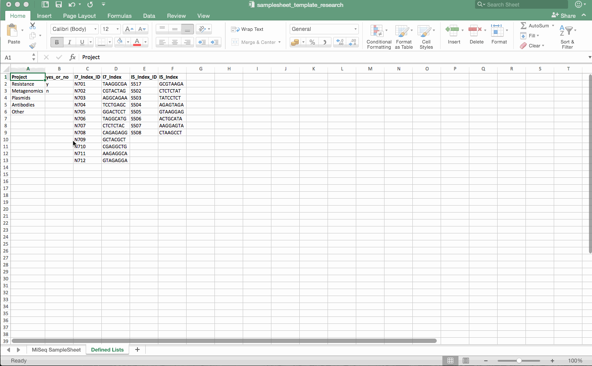

# MiSeq SampleSheet template (Research)
> Excel template to create a compatible SampleSheet for Research (everything else than Resistance)

This is an Excel template to create and save a MiSeq SampleSheet for Research purposes at the Institute of Medical Virology (IMV).

## Worksheets
The Excel template consists of two worksheets. All worksheets are unprotected (with great power comes great responsibility).

### MiSeq SampleSheet
The worksheet which is later used (in .csv format) as SampleSheet for the MiSeq sequencer and after the sequencing run to start the analysis.  
The SampleSheet consists of four sections. The **bold values** are default (but can be changed if needed) and the *italic values* need your input.

#### [Header]
IEMFileVersion: **4**  
Investigator_Name: *your name*  
Experiment_Name: *free text*  
Date: *date when you start the sequencing run*  
Workflow: **GenerateFASTQ**  
Application: **FASTQ Only**  
Assay: **Nextera XT**  
Description: *free text (can be left blank)*  
Chemistry: **Amplicon**  
PhiX: *whole number of % PhiX spiked in*  
RGT_box1 and box2: *RGT number including "RGT"*  
openbis: **y**

#### [Reads]
**151** (Depends on the sequencing kit)

#### [Settings]
ReverseComplement: **0**  
Adapter: **CTGTCTCTTATACACATCT**

#### [Data]
Sample_ID: *consecutively numbered, starting at 1*  
Sample_Name: *short and descriptive name of the sample, this will also be the beginning of the name of the resulting .fastq file*  
Sample_Plate: *free text (can be left blank)*  
Sample_Well: *free text (can be left blank)*  
I7_Index_ID: *ID of the indexprimer used*  
index: *I7 index sequence (hint: if your I7_Index_ID is within the "Defined Lists" worksheet, the corresponding sequence will be displayed automatically)*  
I5_Index_ID: *ID of the indexprimer used*  
index2: *I7 index sequence (hint: if your I5_Index_ID is within the "Defined Lists" worksheet, the corresponding sequence will be displayed automatically)*  
Sample_Project: *select from drop-down list*  
Description: *free text (can be left blank)*  
virus: *free text (can be left blank)*  
genotype: *free text (can be left blank)*  
target: *free text (can be left blank)*  
viral_load: *free text (can be left blank)*  
timavo: *"y" or "n" if you want it to be uploaded to timavo*  
apl: *free text (can be left blank)*

### Defined Lists
All the predefined lists are located here. If a list needs to be changed, it can be done as follows:
* Add additional option in a new row
* In the Formulas Tab open Define Name and change the reference to include the new row  

## Example of use
### Amplicon sequencing
In a two step PCR, you've created amplicons wich contain Illumina sequencing adapters and indices.  

Steps to prepare for sequencing (also described as [Protocol A](http://emea.support.illumina.com/content/dam/illumina-support/documents/documentation/system_documentation/miseq/miseq-denature-dilute-libraries-guide-15039740-10.pdf)):  
- (Equimolar) pooling of samples all having a unique index combination  
- Dilute pool to 4 nM in water or 10 mM Tris-HCl, pH 8.5 (there's a [pooling calculator from Illumina](https://support.illumina.com/help/pooling-calculator/pooling-calculator.htm))  
- Thaw the sequencing cartridge also including HT1 Buffer and prepare the MiSeq for sequencing  
- Combine 5 µL library (4 nM) with 5 µL NaOH (0.2 M)  
- Vortex briefly and centrifuge  
- Incubate at room temperature for 5 minutes  
- Add 990 μL HT1, this results in 1 mL of a 20 pM denatured library  
- Dilute denatured 20 pM library and add PhiX control depending on the complexity of the library and MiSeq reagent kit version  
- Load 600 μL library into the sequencing cartridge  
- Save the filled samplesheet as <MS-Nr.>.csv (important: delimiter symbol must be comma) on the server: `130.60.191.116/Research/Common/Equipment/MiSeq/MiSeqSampleSheets/`
