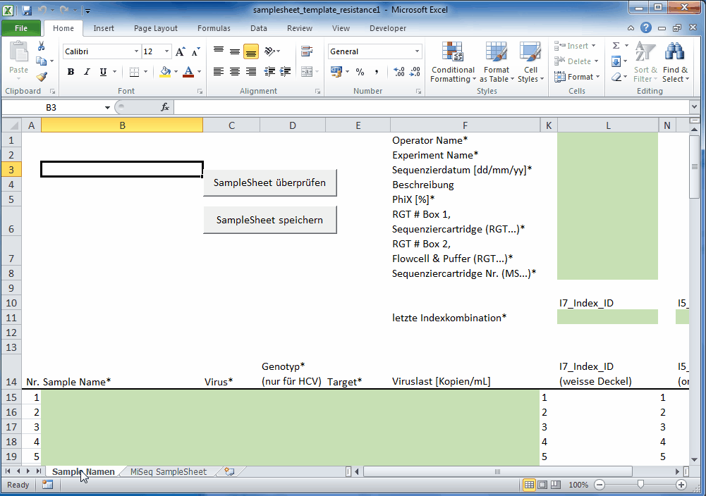

# MiSeq SampleSheet template (Resistance)
> Excel template to create a compatible SampleSheet for Resistance testing

This is an Excel template with underlying VBA code to verify and save a MiSeq SampleSheet for Resistance testing at the Institute of Medical Virology (IMV).

## Worksheets
The Excel template consists of two visible- and three hidden worksheets. All worksheets are protected to avoid unwanted changes. Only designated parts (highlighted in green) are excluded from protection.

### Sample Namen (visible)
The Worksheet where users insert all the informations needed and the indexprimer combinations will be given.

### indices (hidden)
Where all indices (index names and sequences) of the Nextera Index Kit are listed.

### indices order (hidden)
Where the order of the indexprimer combinations is defined. It loops through all 96 combinations by column (A1 to H1, A2 to H2 ... A12 to H12).

### Virus and Target infos (hidden)
Where the Name lists are defined which are allowed in the corresponding fields in the Sample Namen worksheet.  
If the selection needs to be changed, it can be done as follows:
* Unhide Sheet
* Unprotect Sheet...
* Add additional option in a new row
* In the Formulas Tab open Name Manager and change the reference to include the new row
* Protect and Hide Sheet again

### Plate layout (visible)
Shows the index plate with the wells to pipette from including the sample nr. it correspondes to.  
Can be printed to help when pipetting the indices.

### MiSeq SampleSheet (visible)
The worksheet which is later used (in .csv format) as SampleSheet for the MiSeq sequencer and after the sequencing run to start the analysis.

## Macros

There are two Macros (*saveascsv* and *validate*) which can be started by pressing the two buttons in the Sample Namen worksheet.

### SampleSheet überprüfen
The goal of this Macro is to minimize errors in the SampleSheet which may cause problems in the automatic downstream process.
By pressing this button, several tests are performed directly on the MiSeq SampleSheet worksheet (except the MS Nr.):

* Operator Name is within the Operator list
* Sequenzierdatum is in date format and later than 01/01/17
* PhiX is a whole number between 0 and 100
* RGT Box 1 and 2 start with "RGT", are 11 characters in total and are not the same
* MS Nr. starts with "MS", ends with "-150V3" and is 15 characters in total
* Sample_ID is a whole number between 1 and 96
* Sample_Name only contains numbers (0-9), letters (a-z, A-Z) or dashes (-)
* I7 and I5_Index_ID is within the I7 and I5_Index_ID list
* index and index2 is within I7 and I5_Index list
* Sample_Project is within Sample_Project list ("Resistance" or "Other")
* Virus is within Virus list (only if Sample_Project == "Resistance")
* genotype is within Genotyp list (only if Sample_Project == "Resistance")
* target is within Target list (only if Sample_Project == "Resistance")
* viral_load is an integer or empty
* timavo is equal to "n"

If one or more of those conditions isn't fulfilled, the affected cell in the SampleSheet worksheet (except the MS Nr.) is highlighted yellow.  
This step should be repeated until there's no error left.

### SampleSheet speichern
Once all informations are within the SampleSheet and it's valid, it can be saved in .csv format. It's important that the cells are separated by commas.  
For that macro to work the computer needs to be connected to the server and the path mentioned below must be valid (e.g. if a folder name or structure is changed it'll need to be changed in the VBA code too).  
The Macro behind the SampleSheet speichern button works only for Excel on Windows. If you press it, the SampleSheet Worksheet is saved as .csv file with the MS Nr. as filename in the MiSeq folder on the server ("R:\Common\Equipment\MiSeq\MiSeqSampleSheets\" + msnumber + ".csv").  
If you try this on Excel for Mac you'll receive a message that you have to save the SampleSheet manually. In that case you've to select the MiSeq SampleSheet worksheet and save it as .csv file.

## VBA code
The VBA code can be edited best with Excel for Windows (currently there's no proper VBA editor on Excel for Mac).  
The Visual Basic environment can be found under the Developer tab. If this tab is not visible visit [this](https://msdn.microsoft.com/en-us/library/bb608625.aspx) site.  
The code is saved under Modules in SampleSheetTemplateResistance. It contains two Subroutines (begin with `Sub saveascsv()` and `Sub validate()` and end with `End Sub`).
